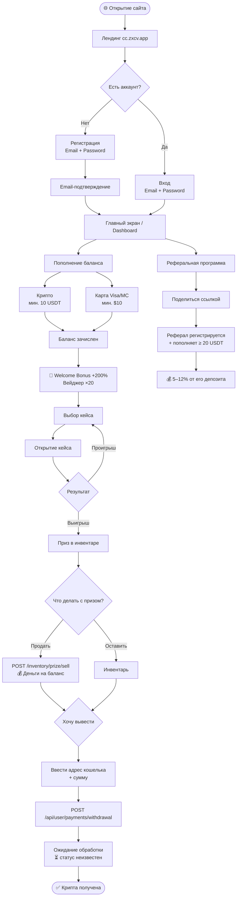
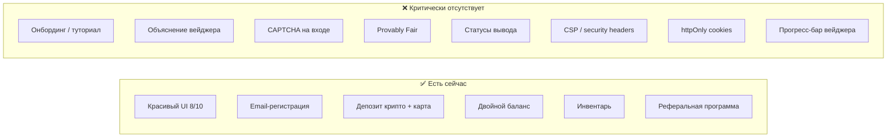

# CJM — CYBERBOX (cc.zxcv.app) — текущее состояние

**Дата:** 2026-02-20
**Источник:** Security & Product Audit
**Роль:** Новый пользователь-игрок (крипто-лутбоксы)

---

## Карта пути пользователя



---

## Детальная карта по стадиям

| Стадия | Действия пользователя | Точки контакта | Эмоции | Боли сейчас | Уязвимости |
|---|---|---|---|---|---|
| **1. Открытие** | Заходит на cc.zxcv.app, смотрит лендинг | Главная страница, визуал кейсов | 😮 Интерес, любопытство | — | Build ID публичен (T15) |
| **2. Регистрация** | Email + пароль, поле реф. кода, подтверждение email | `/sign-up`, `/email-confirmation` | 🙂 Нейтральная | Нет Google/Telegram входа | Нет CAPTCHA → брутфорс (T5) |
| **3. Онбординг** | Попадает на дашборд — **без объяснений** | Dashboard | 😕 Растерянность | Нет туториала, нет объяснения Real vs Bonus баланса, нет объяснения вейджера | — |
| **4. Депозит** | Выбирает крипто или карту, вводит сумму | `/deposit`, PayPecker, крипто-процессинг | 😐 Тревога («всё ли правильно?») | Нет явных комиссий, «итоговая сумма может измениться» | Карта → нет задержки вывода → chargeback (T8/T9) |
| **5. Бонус** | Получает +200% на первый депозит | Уведомление о бонусе | 😀 Восторг | Не понимает, что вейджер = ×20 от бонуса. Нет прогресс-бара | Фарминг через мульти-аккаунты (T5) |
| **6. Игра — открытие кейсов** | Выбирает кейс, нажимает «Открыть» | `/cryptocases`, анимация открытия | 🎰 Азарт / разочарование | Нет Provably Fair — не знает, честно ли | Нет server-side seed → нет доверия |
| **7. Инвентарь** | Смотрит призы, продаёт или оставляет | `/inventory` | 😊 Удовлетворение или 😞 разочарование | Продажа по полной цене — неясно, почему так | Мгновенный выкуп без комиссии → снижает маржу |
| **8. Вывод** | Вводит адрес кошелька и сумму | `/withdrawal` | 😟 Тревога | Нет SLA, нет комиссий, нет статусов транзакции. Валидация только на клиенте | Cookies без httpOnly/secure → XSS → кража токена → вывод на адрес атакующего (T1/T2/T3) |
| **9. Реферальная программа** | Копирует реферальную ссылку, делится | `/referrals` | 💰 Мотивация | 12% от депозита — звучит выгодно, но платформа в минусе | Реферальные фермы через мульти-аккаунты (T5) |

---

## Критические разрывы в опыте (Gap Analysis)



---

## Эмоциональная кривая пользователя

```
Эмоция
  😀 |          *
     |       *     *
  🙂 |    *           *         *
     |  *               *     *   *
  😐 |*                   *  *     *
     |                      *       *
  😕 |                                *
     |__________________________________________→ Стадия
      Открытие  Регистрация  Депозит  Бонус  Игра  Инвентарь  Вывод
```

**Главный провал:** стадия вывода — пользователь не знает статуса, нет SLA, нет комиссий → максимальная тревога.
**Главный подъём:** получение Welcome Bonus +200% — эйфория, которую быстро перекрывает непонимание вейджера.

---

## Сводка рисков на пути пользователя

| Стадия | Риск для пользователя | Риск для платформы |
|---|---|---|
| Регистрация | Брутфорс аккаунта | Фарминг бонусов, реф. фермы |
| Депозит (карта) | — | Chargeback-мошенничество |
| Бонус | Не понимает вейджер → разочарование → отток | Убыточная реф. модель при масштабе |
| Вывод | XSS → кража крипты | Репутационный ущерб, юридическая ответственность |
| Инвентарь | — | Потеря маржи при мгновенном выкупе |

---

*Источник: SECURITY_AUDIT.md — комплексный технический + продуктовый аудит cc.zxcv.app от 2026-02-20*
