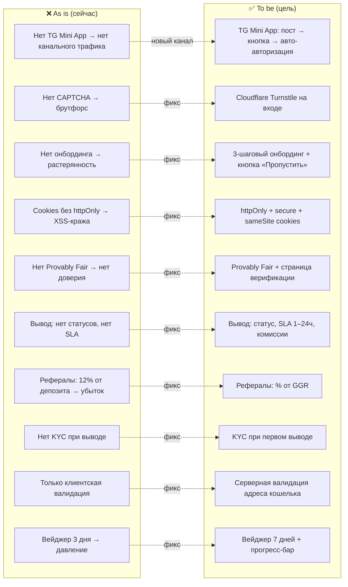
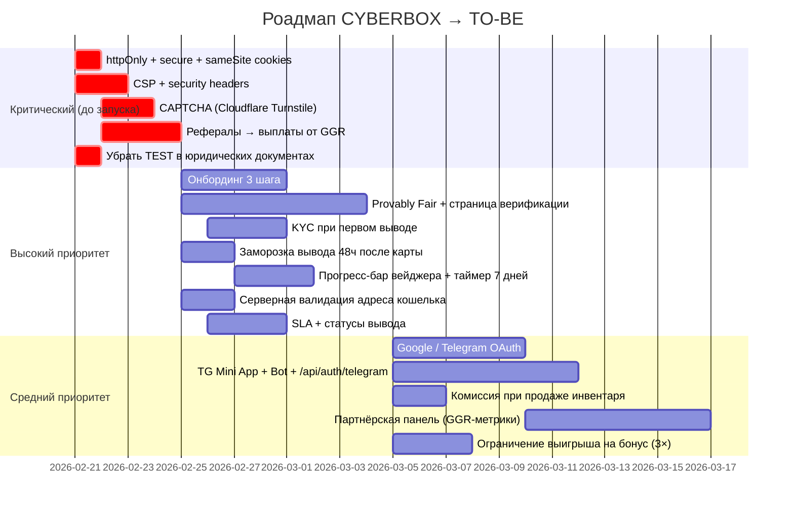

# CJM — CYBERBOX (cc.zxcv.app) — TO-BE (целевое состояние)

**Дата:** 2026-02-20
**Источник:** Security & Product Audit + рекомендации команды
**Роль:** Новый пользователь-игрок (крипто-лутбоксы)

---

## Целевой путь пользователя

```mermaid
flowchart TD
    %% === Точки входа ===
    A([🌐 Открытие сайта]) --> B[Лендинг cc.zxcv.app]
    TG(["📣 Пост в канале CyberBox\nTelegram"]) --> TG1["Кнопка «Открыть» в посте"]
    TG1 --> TG2["Telegram Mini App\nWebApp открывается внутри TG"]
    TG2 --> TG3["api/auth/telegram\nАвто-авторизация через TG Identity"]
    TG3 --> TG4{"Новый пользователь?"}
    TG4 -- Да --> F
    TG4 -- Нет --> G

    %% === Веб-путь ===
    B --> C{"Есть аккаунт?"}
    C -- Нет --> D["Регистрация\nEmail / Google / Telegram"]
    C -- Да --> E["Вход\nEmail / Google / Telegram"]

    D --> D1["CAPTCHA Cloudflare Turnstile"]
    D1 --> D2["Email-подтверждение"]
    D2 --> F

    E --> E1["CAPTCHA Cloudflare Turnstile"]
    E1 --> F

    %% === Онбординг ===
    F["Онбординг — 3 шага"] --> F0{"Пропустить?"}
    F0 -- Да --> G
    F0 -- Нет --> F1["1️⃣ Реальный vs Бонусный баланс"]
    F1 --> F2["2️⃣ Что такое вейджер и как он работает"]
    F2 --> F3["3️⃣ Условия вывода и KYC"]
    F3 --> G

    G["Главный экран / Dashboard"] --> H["Пополнение баланса"]
    H --> H1["Крипто\nмин. 10 USDT\nреал-тайм курс + комиссии"]
    H --> H2["Карта Visa/MC\nмин. $10\n3DS верификация"]

    H1 --> I["Баланс зачислен"]
    H2 --> I2["Баланс зачислен\n⏳ Вывод заморожен на 48ч"]
    I --> J
    I2 --> J

    J["🎁 Welcome Bonus +200%\nВейджер ×20\nПрогресс-бар + таймер 7 дней"] --> K

    K["Выбор кейса"] --> L["Открытие кейса"]
    L --> L1["🔐 Provably Fair\nServer seed hash опубликован до открытия"]
    L1 --> M{"Результат"}
    M -- Выигрыш --> N["Приз в инвентаре"]
    M -- Проигрыш --> K

    N --> O{"Что делать с призом?"}
    O -- Продать --> P["inventory/prize/sell\nКомиссия 5%\n💰 Деньги на баланс"]
    O -- Оставить --> Q["Инвентарь"]

    P --> R{"Хочу вывести"}
    Q --> R

    R --> S{"Первый вывод?"}
    S -- Да --> S1["KYC верификация\nEmail / Phone / ID"]
    S1 --> T
    S -- Нет --> T

    T["Ввести адрес кошелька\n✅ Серверная валидация адреса"] --> U["api/user/payments/withdrawal"]
    U --> V["Статус: В обработке\nSLA: 1–24 ч\nПуш-уведомление при обработке"]
    V --> W(["✅ Крипта получена\n📧 Email-подтверждение"])

    G --> X["Реферальная программа"]
    X --> Y["Поделиться ссылкой"]
    Y --> Z["Реферал регистрируется\n+ пополняет ≥ 20 USDT"]
    Z --> AA["💰 5–12% от GGR реферала\nне от депозита"]
```



---

## Детальная карта по стадиям (TO-BE)

| Стадия | Действия пользователя | Точки контакта | Целевые эмоции | Что меняем | Приоритет |
|---|---|---|---|---|---|
| **0. TG-канал → Mini App** | Видит пост в канале CyberBox → нажимает «Открыть» → Mini App открывается внутри Telegram → авто-авторизован | Пост в канале, кнопка WebApp, `/api/auth/telegram` | 😀 Магия — уже внутри без регистрации | Разработать TG Mini App. Настроить Telegram Bot с кнопкой. Реализовать `/api/auth/telegram` авторизацию. Новый пользователь → онбординг; существующий → сразу дашборд | 🟠 Высокий |
| **1. Открытие** | Заходит на cc.zxcv.app | Лендинг, визуал кейсов | 😮 Интерес + доверие | Убрать публичный Build ID. Добавить значок Provably Fair на лендинге | 🟡 Средний |
| **2. Регистрация** | Email / Google / Telegram + CAPTCHA | `/sign-up`, CAPTCHA, OAuth | 🙂 Быстро и привычно | CAPTCHA (Turnstile). Вход через Google и Telegram. Верификация телефона | 🔴 Критический |
| **3. Онбординг** | Проходит 3-шаговое знакомство или пропускает | Модальное окно / слайды + кнопка «Пропустить» | 😊 Понимание, доверие | Добавить онбординг: Real vs Bonus, вейджер, условия вывода. Кнопка «Пропустить» — доступна всегда, но повторный вход в онбординг через настройки | 🟠 Высокий |
| **4. Депозит** | Выбирает способ, видит все комиссии заранее | `/deposit`, PayPecker | 😐→😊 Прозрачность | Показать все комиссии до оплаты. 48ч заморозка вывода после карты. Оценка риска для нового аккаунта | 🟠 Высокий |
| **5. Бонус** | Получает +200%, видит прогресс-бар вейджера | Уведомление + прогресс-бар | 😀 Азарт + понимание | Прогресс-бар вейджера. Таймер 7 дней (было 3). Ограничение выигрыша 3× депозита | 🟠 Высокий |
| **6. Игра** | Открывает кейс, видит Provably Fair badge | `/cryptocases`, анимация | 🎰 Азарт + доверие | Provably Fair: server seed hash до открытия, верификация после. Страница проверки | 🟠 Высокий |
| **7. Инвентарь** | Смотрит призы, продаёт с комиссией 5% | `/inventory` | 😊 Удовлетворение | Комиссия 5% при продаже. Прозрачная цена выкупа | 🟡 Средний |
| **8. Вывод** | Вводит адрес (проверяется на сервере), видит SLA и комиссии | `/withdrawal` | 😌 Спокойствие | Серверная валидация адреса. SLA «1–24 ч». Комиссии видны до подтверждения. Статусы транзакции. KYC при первом выводе | 🔴 Критический |
| **9. Реферальная программа** | Делится ссылкой, получает % от GGR | `/referrals` | 💰 Выгода | Выплаты переведены с депозита на GGR. Партнёрская панель с реальными метриками | 🔴 Критический |

---

## Gap: что было → что стало



---

## Целевая эмоциональная кривая

```
Эмоция
  😀 |          *    *         *       *       *
     |       *    *    *    *    *  *    *  *    *
  🙂 |    *                                        *
     |  *
  😐 |*
     |__________________________________________________→ Стадия
      Откр.  Рег.  Онб.  Депозит  Бонус  Игра  Инв.  Вывод
```

**Ключевое отличие от as-is:** эмоциональная кривая остаётся стабильно высокой на всём пути. Особенно на стадии вывода — прозрачность + SLA убирают тревогу.

---

## Роадмап внедрения TO-BE



---

## Целевые метрики успеха

| Метрика | As Is | To Be (цель) |
|---|---|---|
| Конверсия регистрация → первый депозит | ~? | +15–20% (онбординг, Google/TG вход) |
| Отток после получения бонуса | Высокий | −30% (понятный вейджер + 7 дней) |
| Доверие крипто-аудитории | ⭐ 2/10 | ⭐⭐⭐⭐ 7/10 (Provably Fair) |
| Убытки от реферальных ферм | Критические | ~0 (выплаты от GGR + CAPTCHA) |
| Риск кражи аккаунта через XSS | CRITICAL | LOW (httpOnly cookies) |
| Tревога на стадии вывода | Высокая | Низкая (SLA + статусы) |
| Конверсия из TG-канала | 0% (нет Mini App) | +X% новых игроков из канала CyberBox |

---

*Целевое состояние основано на: SECURITY_AUDIT.md + продуктовых рекомендациях команды от 2026-02-20*
