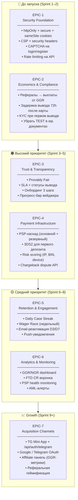
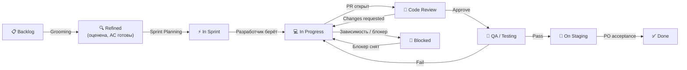
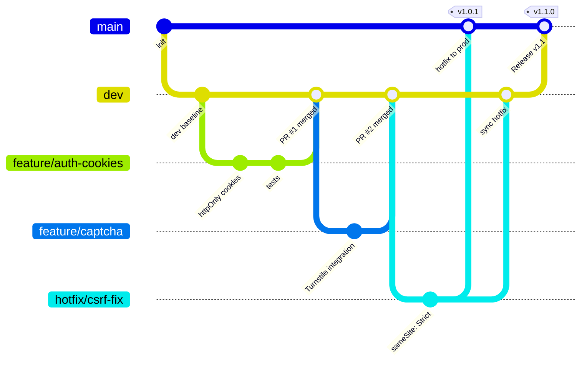
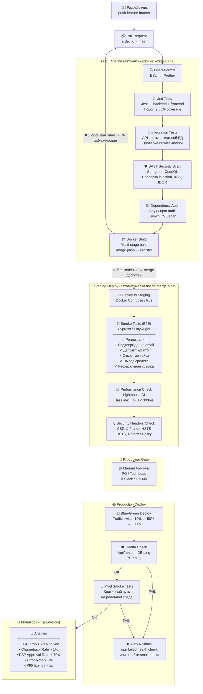
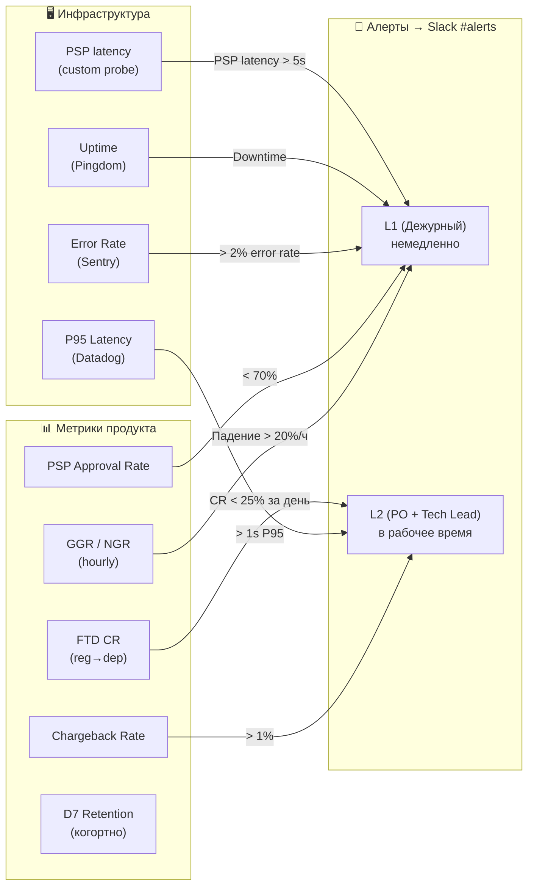

# Рабочий процесс разработки — CYBERBOX

Документ описывает как должен быть организован процесс разработки продукта:
структуру проекта в Jira, Git-workflow и зрелый CI/CD pipeline с автотестами.

---

## Часть 1. Структура проекта в Jira

### 1.1 Иерархия задач

```
Project: CYBERBOX
│
├── Epic  (квартальная цель)
│     ├── Story  (ценность для пользователя, 1–5 дней)
│     │     ├── Task  (конкретная работа, < 1 дня)
│     │     └── Sub-task  (часть задачи)
│     └── Bug  (привязан к Story или к эпику)
│
└── Technical Debt  (отдельный тип, не попадает в product backlog)
```

**Принципы:**
- Story пишется от лица пользователя: *«Как игрок, я хочу видеть статус вывода, чтобы не беспокоиться»*
- Каждая Story имеет Acceptance Criteria (2–5 пунктов) и Definition of Done
- Bug создаётся с приоритетом P0–P3 и привязкой к среде воспроизведения

---

### 1.2 Эпики проекта



---

### 1.3 Jira Workflow



**Правила перехода:**
- `Backlog → Refined`: оценена в SP, написаны AC, нет открытых вопросов
- `In Progress → Code Review`: PR открыт, линт и тесты зелёные, самопроверка пройдена
- `Code Review → QA`: минимум 1 апрув, CI pipeline зелёный
- `On Staging → Done`: PO или тестировщик подтвердил сценарии на стейджинге

---

### 1.4 Definition of Done

```
☐ Код покрыт юнит-тестами (≥ 80% новых строк)
☐ Интеграционные тесты обновлены / добавлены
☐ E2E-тест на критичный путь (если затронут флоу пользователя)
☐ PR-ревью: ≥ 1 апрув от другого разработчика
☐ CI pipeline зелёный (lint + unit + integration + SAST)
☐ Функциональность проверена на staging-среде
☐ Документация обновлена (если API изменился)
☐ PO подтвердил соответствие Acceptance Criteria
```

---

### 1.5 Ритм команды (4 человека)

| Церемония | Когда | Длительность | Участники |
|---|---|---|---|
| Sprint Planning | Пн, начало спринта | 1 ч | Все |
| Daily Standup | Каждый день | 10 мин | Все |
| Backlog Grooming | Ср, середина спринта | 45 мин | PO + Tech Lead |
| Sprint Review | Пт, конец спринта | 30 мин | Все |
| Retrospective | Пт, после Review | 30 мин | Все |

**Спринт:** 1 неделя. Velocity фиксируется с 3-го спринта, не раньше.

---

## Часть 2. Git Workflow & CI/CD Pipeline

### 2.1 Branch Strategy



**Правила веток:**
- `main` — только из `dev` через PR, после зелёного CI. Protected. Прямые пуши запрещены.
- `dev` — интеграционная ветка. CI обязателен на каждый PR.
- `feature/*` — одна задача / одна Story. Живёт не дольше 3 дней.
- `hotfix/*` — критические фиксы в прод. Мержится в `main` И `dev`.
- `release/*` — при необходимости подготовки релиза (feature freeze).

---

### 2.2 CI/CD Pipeline — полная схема



---

### 2.3 Стратегия тестирования

```
Пирамида тестов:
                  ▲
                 /E\      E2E (Cypress/Playwright)
                /   \     → Критичные пользовательские сценарии
               /─────\    → Запускаются на staging после каждого деплоя
              /  INT  \   Integration Tests (Jest + Supertest)
             /─────────\  → API-эндпоинты с тестовой БД
            /   UNIT    \ → Бизнес-логика: вейджер, бонусы, рефералы, RTP
           /─────────────\
```

| Тип | Инструмент | Запуск | Порог |
|---|---|---|---|
| Unit | Jest | каждый PR | ≥ 80% coverage новых строк |
| Integration | Jest + Supertest | каждый PR | все тесты зелёные |
| E2E smoke | Cypress / Playwright | после деплоя на staging | 100% критичных сценариев |
| SAST | Semgrep / CodeQL | каждый PR | 0 HIGH/CRITICAL |
| Dependency audit | Snyk | каждый PR + ежедневно | 0 CRITICAL CVE |
| DAST | OWASP ZAP | еженедельно (scheduled) | ручная проверка отчёта |
| Load test | k6 | еженедельно (scheduled) | P95 < 500ms при 500 RPS |

---

### 2.4 Окружения

| Окружение | Назначение | Деплой | База данных |
|---|---|---|---|
| **local** | Разработка | `docker compose up` | Локальная PostgreSQL |
| **dev** | Интеграция после merge в dev | Автоматически | Shared test DB |
| **staging** | QA, PO acceptance, smoke tests | Автоматически после CI | Staging DB (prod-like data) |
| **production** | Реальные пользователи | Manual approval → auto | Production PostgreSQL |

---

### 2.5 Scheduled Jobs (фоновые проверки)

| Job | Расписание | Инструмент | Действие при сбое |
|---|---|---|---|
| Dependency audit | Ежедневно 09:00 | Snyk | Тикет в Jira, уведомление в Slack |
| DAST scan | Еженедельно, пн | OWASP ZAP | Ручная проверка отчёта PM + SecEng |
| Load test | Еженедельно, пт | k6 | Сравнение с baseline, алерт при деградации |
| DB backup check | Ежедневно | pg_dump verify | PagerDuty alert |
| SSL cert expiry | Ежедневно | certbot check | Алерт за 30/7/1 день до истечения |
| AML transaction scan | Ежедневно | Chainalysis API | Автоматическая заморозка + тикет |

---

### 2.6 Мониторинг & Алерты



---

*Документ разработан как часть продуктового аудита CYBERBOX. Отражает best practices CI/CD и процессного управления для iGaming-продуктов.*
