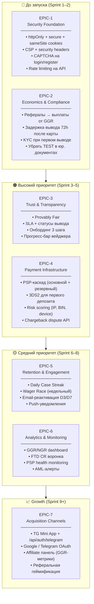
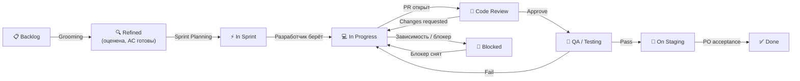
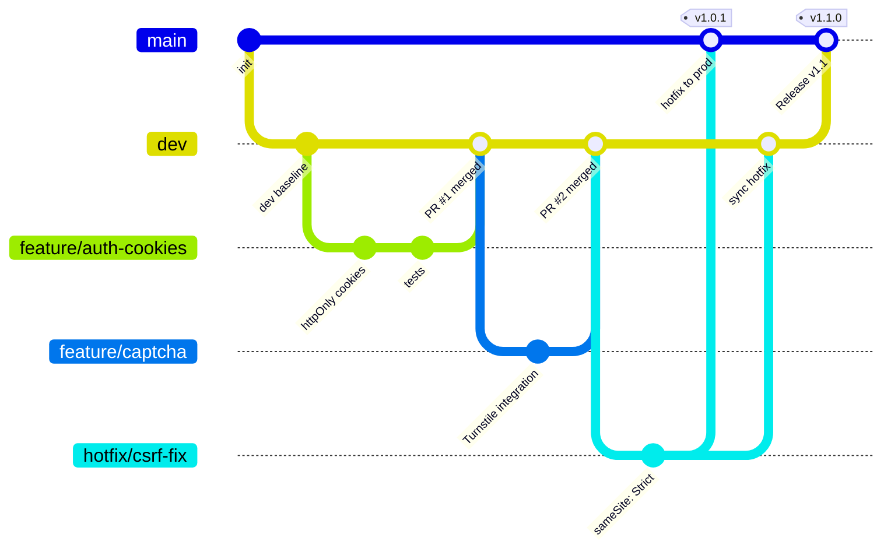
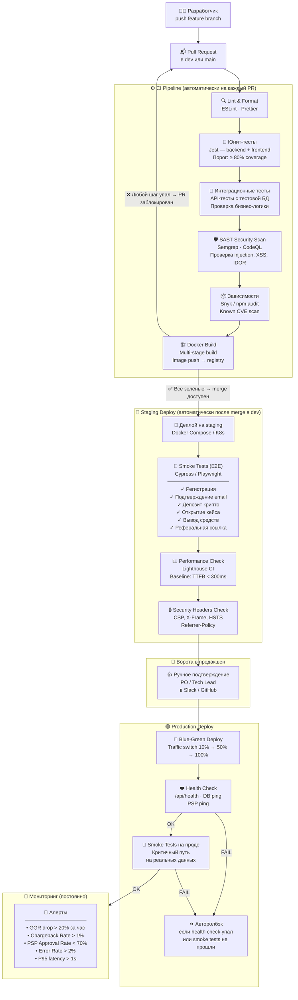
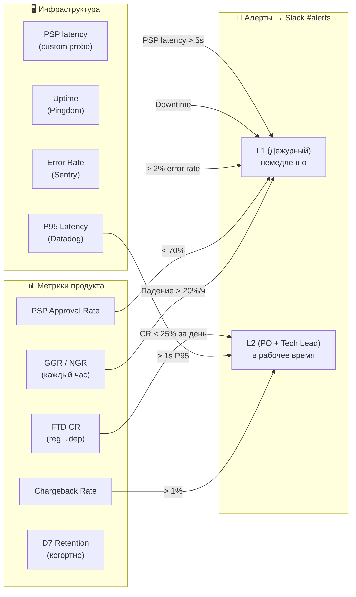

# Рабочий процесс разработки — CYBERBOX

iGaming не прощает ошибок в продакшене: баг в выводе средств — это не просто тикет,
это chargeback, заморозка PSP и репутационный ущерб. Поэтому процесс выстроен так,
чтобы сломанный код физически не мог попасть на прод — его останавливают автоматически
на нескольких рубежах до того, как его увидит пользователь.

---

## Часть 1. Структура проекта в Jira

### 1.1 Иерархия задач

```text
Project: CYBERBOX
│
├── Epic  (квартальная цель)
│     ├── Story  (ценность для пользователя, 1–5 дней)
│     │     ├── Task  (конкретная работа, < 1 дня)
│     │     └── Sub-task  (часть задачи)
│     └── Bug  (привязан к Story или к эпику)
│
└── Technical Debt  (отдельный тип, не попадает в product backlog)
```

**Принципы:**

- Story пишется от лица пользователя: *«Как игрок, я хочу видеть статус вывода, чтобы не беспокоиться»*
- Каждая Story имеет Acceptance Criteria (2–5 пунктов) и Definition of Done
- Bug создаётся с приоритетом P0–P3 и привязкой к среде воспроизведения

---

### 1.2 Эпики проекта

Работу разбили на 4 волны по принципу "сначала то, без чего нельзя запуститься".
Первые два спринта — только безопасность и экономика: одна уязвимость в cookies
или убыточная реферальная модель способны убить продукт до того, как он наберёт аудиторию.
Retention и аналитика идут позже — когда есть кому удерживать.



---

### 1.3 Как задача движется по доске



**Когда можно переводить статус:**

- `Backlog → Refined`: задача оценена в Story Points, AC написаны, открытых вопросов нет
- `In Progress → Code Review`: PR открыт, линт и тесты зелёные, сам прошёлся по diff
- `Code Review → QA`: хотя бы один апрув, CI зелёный
- `On Staging → Done`: PO или тестировщик подтвердил сценарии на стейджинге

---

### 1.4 Definition of Done

Задача считается сделанной, когда её можно выкатить в прод без страха.
Для этого нужно выполнить всё из списка — не 7 из 8, а всё:

```text
☐ Код покрыт юнит-тестами (≥ 80% новых строк)
☐ Интеграционные тесты обновлены / добавлены
☐ E2E-тест на критичный путь (если затронут флоу пользователя)
☐ PR-ревью: ≥ 1 апрув от другого разработчика
☐ Все автоматические проверки прошли (lint + unit + integration + SAST)
☐ Функциональность проверена на staging
☐ Документация обновлена (если API изменился)
☐ PO подтвердил соответствие Acceptance Criteria
```

---

### 1.5 Ритм команды (4 человека)

| Встреча | Когда | Длительность | Участники |
| --- | --- | --- | --- |
| Sprint Planning | Пн, начало спринта | 1 ч | Все |
| Daily Standup | Каждый день | 10 мин | Все |
| Backlog Grooming | Ср, середина спринта | 45 мин | PO + Tech Lead |
| Sprint Review | Пт, конец спринта | 30 мин | Все |
| Retrospective | Пт, после Review | 30 мин | Все |

**Спринт:** 1 неделя. Каждую пятницу — демо реального работающего кода, не отчёты о прогрессе.
Это даёт фаундерам и стейкхолдерам видимость раз в неделю без лишних созвонов.
Velocity начинаем считать с 3-го спринта — раньше цифры ничего не скажут.

---

## Часть 2. Git и CI/CD

### 2.1 Стратегия веток



**Правила веток:**

- `main` — только из `dev` через PR после зелёного CI. Прямые пуши заблокированы.
- `dev` — интеграционная ветка. CI обязателен на каждый PR.
- `feature/*` — одна задача, одна Story. Живёт не дольше 3 дней.
- `hotfix/*` — срочные фиксы в прод. Мержится и в `main`, и в `dev`.
- `release/*` — когда нужна заморозка перед релизом.

---

### 2.2 CI/CD Pipeline — полная схема

Пайплайн выстроен по принципу "ранняя поломка дешевле поздней". Каждый слой ловит свой класс проблем:

- **Lint** — опечатки и стилевые ошибки. Секунды, дёшево.
- **Unit + Integration** — бизнес-логика сломана? Видим сразу, не после деплоя.
- **SAST** — автоматический поиск SQL-инъекций, XSS, IDOR в коде. То, что code review пропускает.
- **Snyk** — известные CVE в зависимостях. Log4Shell-подобные проблемы ловим до попадания в прод.
- **E2E smoke** — критичный путь пользователя (регистрация → депозит → вывод) проходит на реальном стейджинге.
- **Ручной гейт** — перед продом PO или Tech Lead подтверждают в Slack. Последний человеческий фильтр.
- **Авторолбэк** — если после деплоя health check или smoke упали, трафик автоматически возвращается на предыдущую версию.



---

### 2.3 Стратегия тестирования

```text
Пирамида тестов:
                  ▲
                 /E\      E2E (Cypress/Playwright)
                /   \     → Критичные пользовательские сценарии
               /─────\    → Запускаются на staging после каждого деплоя
              /  INT  \   Интеграционные (Jest + Supertest)
             /─────────\  → API-эндпоинты с тестовой БД
            /   UNIT    \ → Бизнес-логика: вейджер, бонусы, рефералы, RTP
           /─────────────\
```

| Тип | Инструмент | Запуск | Порог |
| --- | --- | --- | --- |
| Unit | Jest | каждый PR | ≥ 80% coverage новых строк |
| Integration | Jest + Supertest | каждый PR | все тесты зелёные |
| E2E smoke | Cypress / Playwright | после деплоя на staging | 100% критичных сценариев |
| SAST | Semgrep / CodeQL | каждый PR | 0 HIGH/CRITICAL |
| Dependency audit | Snyk | каждый PR + ежедневно | 0 CRITICAL CVE |
| DAST | OWASP ZAP | еженедельно | ручная проверка отчёта |
| Load test | k6 | еженедельно | P95 < 500ms при 500 RPS |

---

### 2.4 Окружения

| Окружение | Для чего | Деплой | База данных |
| --- | --- | --- | --- |
| **local** | Разработка | `docker compose up` | Локальная PostgreSQL |
| **dev** | Интеграция после merge в dev | Автоматически | Общая тестовая БД |
| **staging** | QA, приёмка PO, smoke tests | Автоматически после CI | Staging DB (данные как на проде) |
| **production** | Реальные пользователи | Ручное подтверждение → авто | Production PostgreSQL |

---

### 2.5 Регулярные автоматические проверки

Помимо проверок на каждый PR, часть задач безопасности и стабильности
запускается по расписанию — они не зависят от того, был ли коммит сегодня.

| Проверка | Расписание | Инструмент | Что делаем при сбое |
| --- | --- | --- | --- |
| Зависимости на известные CVE | Ежедневно 09:00 | Snyk | Тикет в Jira + уведомление в Slack |
| DAST-сканирование (динамический анализ) | Еженедельно, пн | OWASP ZAP | PM + SecEng смотрят отчёт вручную |
| Нагрузочный тест | Еженедельно, пт | k6 | Сравниваем с baseline, алерт при деградации |
| Проверка бэкапа БД | Ежедневно | pg_dump verify | PagerDuty |
| Срок SSL-сертификата | Ежедневно | certbot check | Алерт за 30 / 7 / 1 день до истечения |
| AML-сканирование транзакций | Ежедневно | Chainalysis API | Авто-заморозка + тикет |

---

### 2.6 Мониторинг и алерты

Пороги выбраны не произвольно — это отраслевые триггеры для iGaming:
`Chargeback > 1%` — риск отключения PSP (платёжный провайдер вправе расторгнуть договор).
`GGR drop > 20%/ч` — аномалия, которую нельзя объяснить органикой: либо упал платёжный шлюз, либо что-то сломалось в выдаче кейсов.
`PSP Approval Rate < 70%` — платежи не проходят, пользователи уходят без депозита.



---

*Документ написан в рамках продуктового аудита CYBERBOX (февраль 2026).*
